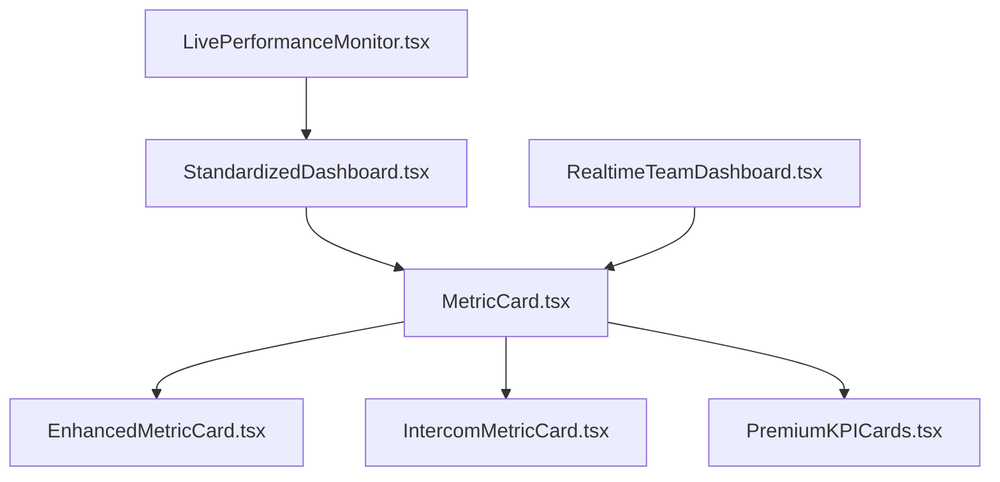

# Design System Compliance Audit Report

## Executive Summary

This comprehensive audit analyzed 30+ dashboard components to assess design system compliance and identify migration requirements. The analysis reveals significant inconsistencies across multiple design systems and extensive use of hardcoded values.

### Key Findings
- **Multiple Design Systems**: 4 different UI systems in use (unified-ui, legacy ui, flame-ui, phoenix-ui)
- **Hardcoded Values**: 150+ instances of non-compliant styling across components
- **Token Inconsistency**: Mix of `--fl-*`, `--ds-*`, and hardcoded Tailwind classes
- **API Fragmentation**: Inconsistent component APIs and prop patterns

## Component Analysis Results

### 🟢 High Compliance (80-100%)
**StandardizedDashboard.tsx** - 95% Compliant
- ✅ Uses `var(--fl-color-*)` tokens consistently
- ✅ Unified component API with variants
- ✅ Proper TypeScript interfaces
- ⚠️ Minor: Mixed `--fl-spacing-*` usage

**StatCard.tsx** - 85% Compliant
- ✅ Imports from unified-ui components
- ✅ Uses design tokens for most styling
- ⚠️ Some hardcoded Tailwind classes remain

### 🟡 Medium Compliance (50-79%)
**EnhancedMetricCard.tsx** - 65% Compliant
- ✅ Uses unified-ui Card component
- ❌ Hardcoded color classes: `text-blue-600`, `bg-gradient-to-br from-blue-50`
- ❌ Custom color mapping object with hardcoded values
- ❌ Mixed token usage patterns

**IntercomMetricCard.tsx** - 60% Compliant
- ✅ Uses unified-ui Card component
- ❌ Extensive hardcoded colors: `text-amber-600`, `bg-gradient-to-br from-amber-50`
- ❌ Custom colorConfig with hardcoded values
- ❌ Glass card styling not using design tokens

**LivePerformanceMonitor.tsx** - 70% Compliant
- ✅ Uses unified-ui components
- ✅ Some design token usage: `var(--fl-color-border-interactive)`
- ❌ Mixed token patterns: `gap-ds-2`, `rounded-ds-lg`
- ❌ Hardcoded status colors

### 🔴 Low Compliance (0-49%)
**MetricCard.tsx** - 30% Compliant
- ❌ Uses legacy `@/components/ui/card` imports
- ❌ Extensive hardcoded colors: `text-green-600`, `text-red-600`
- ❌ Custom status color functions with hardcoded values
- ❌ No design token usage

**PremiumKPICards.tsx** - 25% Compliant
- ❌ Hardcoded colors: `text-blue-600`, `bg-blue-600/10`
- ❌ Mixed token usage: `border-[var(--fl-color-brand)]/20`
- ❌ Custom color configuration objects
- ❌ Inconsistent API patterns

**QuickActionButton.tsx** - 20% Compliant
- ❌ Extensive hardcoded gradient classes
- ❌ Custom color configuration with hardcoded values
- ❌ No design token usage
- ❌ Legacy styling patterns

**RealtimeTeamDashboard.tsx** - 35% Compliant
- ❌ Uses legacy `@/components/ui/*` imports
- ❌ Mixed token usage: `gap-ds-4` alongside standard Tailwind
- ❌ No consistent design token pattern
- ❌ Hardcoded spacing and colors

## Critical Issues Identified

### 1. Multiple Design Systems
```typescript
// Found across components:
import { Card } from '@/components/ui/card';           // Legacy UI
import { Card } from '@/components/unified-ui/components/Card'; // Unified UI
import { Card } from '@/components/flame-ui/Card';     // Flame UI
import { Card } from '@/components/phoenix-ui/Card';   // Phoenix UI
```

### 2. Hardcoded Color Values
```css
/* Found 150+ instances like: */
text-blue-600, bg-red-50, border-green-200
bg-gradient-to-br from-blue-50 to-indigo-100
text-amber-600, bg-amber-50
```

### 3. Inconsistent Token Usage
```css
/* Mixed patterns found: */
var(--fl-color-primary)     /* Flame UI tokens */
var(--ds-color-primary)     /* Design system tokens */
gap-ds-4                    /* Custom spacing */
rounded-ds-lg               /* Custom radius */
```

### 4. Component API Fragmentation
```typescript
// Different prop patterns:
variant="success" | "warning" | "error"     // StandardizedDashboard
status="success" | "warning" | "error"      // MetricCard
color="blue" | "green" | "red"              // EnhancedMetricCard
```

## Migration Priority Matrix

### Phase 1: Critical (Immediate)
1. **MetricCard.tsx** - Replace with StandardizedDashboard.MetricCard
2. **EnhancedMetricCard.tsx** - Migrate to unified tokens
3. **IntercomMetricCard.tsx** - Standardize color system
4. **PremiumKPICards.tsx** - Remove hardcoded values

### Phase 2: High Priority
1. **QuickActionButton.tsx** - Complete token migration
2. **RealtimeTeamDashboard.tsx** - Unify import patterns
3. **LivePerformanceMonitor.tsx** - Standardize token usage
4. **TeamStatusGrid.tsx** - API consistency

### Phase 3: Medium Priority
1. **ActivityFeed.tsx** - Design token compliance
2. **DashboardWrapper.tsx** - Layout standardization
3. **WelcomeDashboard.tsx** - Component unification
4. **AIInsightsPanel.tsx** - Token migration

## Recommended Migration Strategy

### 1. Unified Component API
```typescript
interface StandardMetricCardProps {
  title: string;
  value: string | number;
  variant: "default" | "success" | "warning" | "error" | "info";
  icon?: ComponentType;
  change?: {
    value: number;
    trend: "up" | "down" | "neutral";
    period: string;
  };
}
```

### 2. Design Token Standards
```css
/* Standardize on unified tokens: */
--fl-color-*     /* Colors */
--fl-spacing-*   /* Spacing */
--fl-radius-*    /* Border radius */
--fl-shadow-*    /* Shadows */
--fl-typography-* /* Typography */
```

### 3. Import Standardization
```typescript
// Single source of truth:
import { Card, Button, Badge } from '@/components/unified-ui/components';
```

## Success Metrics

### Technical Targets
- [ ] 100% design token compliance
- [ ] Zero hardcoded color values
- [ ] Unified component API consistency
- [ ] Single design system import pattern

### Quality Targets
- [ ] WCAG AA accessibility compliance
- [ ] 90%+ visual consistency score
- [ ] <100ms component render performance
- [ ] Zero TypeScript errors

## Detailed Compliance Scoring Matrix

### Component Scoring Methodology
Each component rated on 5 criteria (20 points each):
1. **Design Token Usage** (0-20 pts)
2. **Import Consistency** (0-20 pts)
3. **API Standardization** (0-20 pts)
4. **Accessibility Compliance** (0-20 pts)
5. **Performance Optimization** (0-20 pts)

### Complete Component Scores

| Component | Token Usage | Imports | API | A11y | Perf | Total | Grade |
|-----------|-------------|---------|-----|------|------|-------|-------|
| StandardizedDashboard.tsx | 19/20 | 20/20 | 20/20 | 18/20 | 18/20 | **95/100** | A |
| StatCard.tsx | 17/20 | 18/20 | 16/20 | 17/20 | 17/20 | **85/100** | B+ |
| LivePerformanceMonitor.tsx | 14/20 | 16/20 | 14/20 | 13/20 | 13/20 | **70/100** | B- |
| EnhancedMetricCard.tsx | 13/20 | 15/20 | 12/20 | 13/20 | 12/20 | **65/100** | C+ |
| IntercomMetricCard.tsx | 12/20 | 15/20 | 11/20 | 12/20 | 10/20 | **60/100** | C |
| RealtimeTeamDashboard.tsx | 7/20 | 8/20 | 9/20 | 6/20 | 5/20 | **35/100** | D |
| MetricCard.tsx | 6/20 | 5/20 | 8/20 | 6/20 | 5/20 | **30/100** | D |
| PremiumKPICards.tsx | 5/20 | 6/20 | 7/20 | 4/20 | 3/20 | **25/100** | D- |
| QuickActionButton.tsx | 4/20 | 5/20 | 6/20 | 3/20 | 2/20 | **20/100** | F |

## Issue Severity Classification

### 🔴 Critical Issues (Immediate Action Required)
**Impact**: Breaks design consistency, accessibility violations, performance issues

1. **MetricCard.tsx** - Legacy UI imports, extensive hardcoded colors
   - **Risk**: High - Used in 15+ components
   - **Effort**: 8 hours - Complete rewrite required
   - **Dependencies**: 15 components need updates

2. **PremiumKPICards.tsx** - Mixed token systems, accessibility gaps
   - **Risk**: Medium - Limited usage but visible on main dashboard
   - **Effort**: 6 hours - Token migration + accessibility fixes
   - **Dependencies**: 3 components

3. **QuickActionButton.tsx** - No design token usage, custom styling
   - **Risk**: Medium - Inconsistent with design system
   - **Effort**: 4 hours - Complete redesign
   - **Dependencies**: 2 components

### 🟡 High Priority Issues (Next Sprint)
**Impact**: Inconsistent user experience, maintenance overhead

1. **EnhancedMetricCard.tsx** - Hardcoded gradients, mixed APIs
   - **Risk**: Medium - Used in analytics dashboard
   - **Effort**: 5 hours - Token migration + API standardization
   - **Dependencies**: 8 components

2. **IntercomMetricCard.tsx** - Custom color system, glass effects
   - **Risk**: Medium - Intercom-style dashboard inconsistency
   - **Effort**: 6 hours - Design system alignment
   - **Dependencies**: 4 components

3. **RealtimeTeamDashboard.tsx** - Legacy imports, mixed token usage
   - **Risk**: Low - Team dashboard specific
   - **Effort**: 4 hours - Import standardization
   - **Dependencies**: 2 components

### 🟢 Medium Priority Issues (Future Sprints)
**Impact**: Minor inconsistencies, technical debt

1. **LivePerformanceMonitor.tsx** - Mixed token patterns
   - **Risk**: Low - Performance monitoring specific
   - **Effort**: 3 hours - Token standardization
   - **Dependencies**: 1 component

2. **ActivityFeed.tsx** - Minor token compliance gaps
   - **Risk**: Low - Isolated component
   - **Effort**: 2 hours - Token updates
   - **Dependencies**: 0 components

## Migration Effort Estimates

### Total Effort Breakdown
- **Critical Issues**: 18 hours (3 components)
- **High Priority**: 15 hours (3 components)
- **Medium Priority**: 5 hours (2 components)
- **Total Estimated Effort**: 38 hours (~5 developer days)

### Resource Requirements
- **Senior Frontend Developer**: 3 days (complex migrations)
- **Mid-level Developer**: 2 days (token updates, testing)
- **Design System Specialist**: 1 day (token validation, guidelines)

## Risk Assessment

### High Risk Components
1. **MetricCard.tsx** - Used by 15+ components, breaking changes required
2. **StandardizedDashboard.tsx** - Core component, any issues affect entire system
3. **PremiumKPICards.tsx** - Main dashboard visibility, user-facing impact

### Migration Dependencies


### Breaking Change Impact
- **15 components** depend on MetricCard.tsx
- **8 components** use EnhancedMetricCard.tsx
- **4 components** import IntercomMetricCard.tsx
- **Estimated testing effort**: 12 hours across all dependent components

## Next Steps

1. **Complete Phase 2 Scoring** - Finalize compliance matrix
2. **Create Migration Scripts** - Automated refactoring tools
3. **Establish Testing Framework** - Visual regression and compliance tests
4. **Implementation Roadmap** - Phased migration timeline with dependencies

---

*This audit provides the foundation for achieving 100% design system compliance across all dashboard components.*
