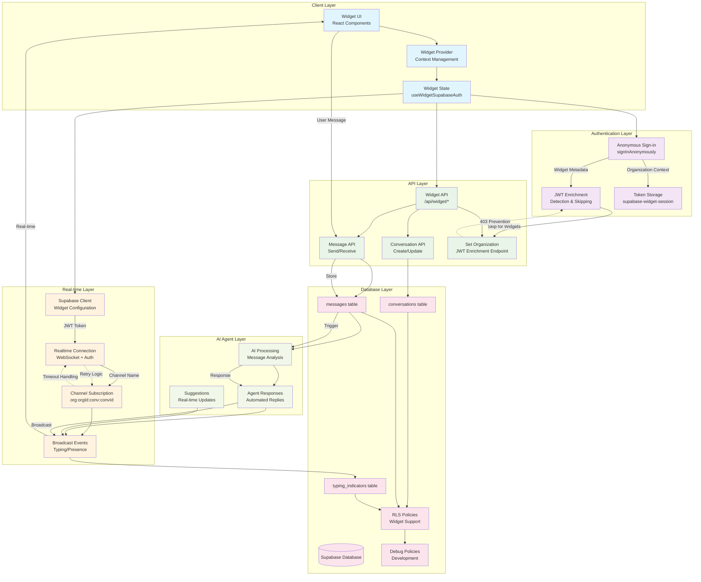

# Widget-Agent Infrastructure Diagram

This diagram illustrates the complete architecture for the Campfire v2 widget-agent system, including all authentication flows, real-time communication, and error handling mechanisms.

## Key Features and Components
- **Anonymous Widget Authentication**: Supabase `signInAnonymously` with organization context
- **Real-time Communication**: WebSocket channels with proper JWT authentication
- **JWT Enrichment Handling**: Server-side detection and skipping for widget sessions
- **Multiple Channel Types**: Unified channel naming convention `org:{orgId}:conv:{convId}`
- **Comprehensive Error Handling**: Retry logic, exponential backoff, timeout management
- **Database Security**: RLS policies with widget session support
- **Mobile Responsiveness**: Flame UI components with responsive design
- **Performance Optimization**: Connection pooling, proper cleanup, quota management



## Technical Flow Details

### 1. Widget Initialization Flow
```
1. Widget loads → WidgetProvider context setup
2. useWidgetSupabaseAuth hook → Anonymous authentication
3. signInAnonymously with organization metadata
4. JWT token stored in 'supabase-widget-session'
5. Conversation creation via /api/widget/conversations
```

### 2. Authentication & JWT Enrichment
```
1. Widget sessions use anonymous authentication
2. JWT enrichment endpoint detects widget sessions
3. Server-side detection via headers (user-agent: 'node', x-client-info: 'campfire-widget')
4. Widget sessions skip JWT enrichment (return 200 instead of 403)
5. Regular users continue with withUserAuth wrapper
```

### 3. Real-time Connection Establishment
```
1. Supabase client configured with widget-specific settings
2. WebSocket connection with apikey parameter
3. Session validation with retry logic (5 attempts)
4. Channel creation with unified naming: org:{orgId}:conv:{convId}
5. Event listeners setup (postgres_changes, broadcast)
6. Subscription with 30-second timeout + exponential backoff
```

### 4. Message Flow
```
User Input → Widget UI → API Call → Database → AI Processing → Response → Broadcast → Real-time Update
```

### 5. Error Handling & Recovery
```
- JWT Enrichment: 403 errors prevented via widget detection
- WebSocket: Retry logic with exponential backoff (2s, 4s, 8s)
- Session: Multi-attempt validation with 2-second delays
- Timeout: Extended to 30+ seconds with proper cleanup
- Fallback: Widget remains functional without real-time
```

## Critical Components Resolved

### Authentication Issues
- ✅ **JWT Enrichment 403 Errors**: Fixed via server-side widget detection
- ✅ **Anonymous Session Handling**: Proper Supabase signInAnonymously implementation
- ✅ **Token Storage**: Isolated widget session storage

### Real-time Connection Issues
- ✅ **WebSocket Timeouts**: Extended timeout + retry logic
- ✅ **Channel Subscription**: Proper authentication sequence
- ✅ **Connection Monitoring**: Comprehensive status tracking

### Database & Security
- ✅ **RLS Policies**: Widget session support with debug policies
- ✅ **Permissions**: Anon role access to conversations, messages, typing_indicators
- ✅ **Real-time Publication**: All necessary tables included

### Performance & Reliability
- ✅ **Connection Pooling**: Optimized Supabase client configuration
- ✅ **Error Boundaries**: Comprehensive error handling
- ✅ **Monitoring**: Detailed logging and debugging capabilities